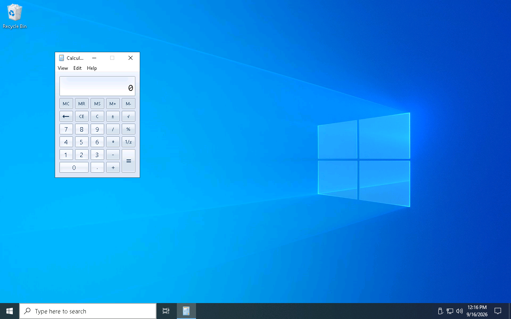
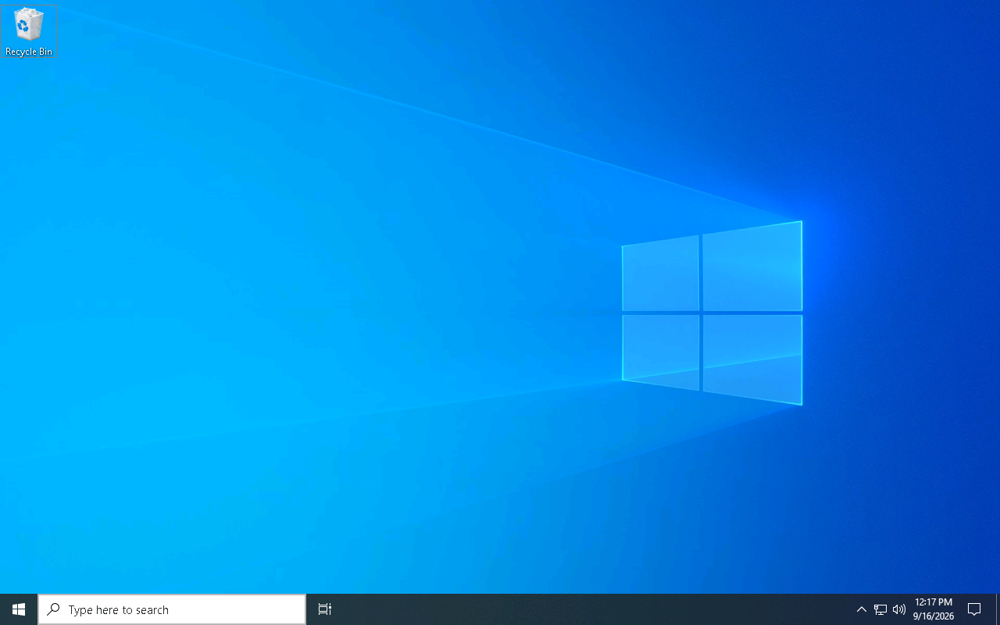
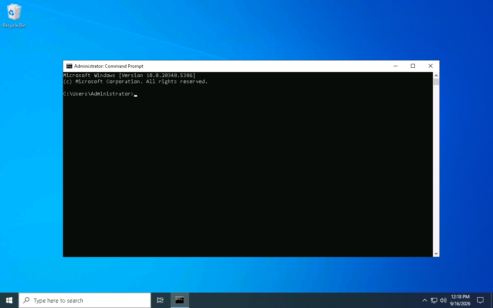
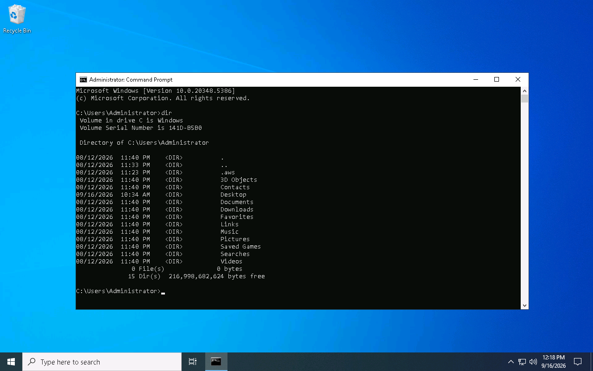

# rdp_pipe

Python desktop RDP client for Linux operators connecting to remote hosts over RDP with NLA (CredSSP) and NTLM password authentication. The UI is a native PyQt6 window with pointer-gated keyboard input and seamless resize via MS-RDPEDISP when the server supports it.

## Prerequisites

- **pyenv** with the Python version named in **`.python-version`** installed locally (the file is required in every clone; install that interpreter with pyenv before pip)
- An X11 or Wayland desktop session for PyQt6
- Network reachability to the target host on TCP 3389 (or the port in the URL)

## Install

From the repo root with pyenv active:

```bash
pip install -e ".[dev]"
```

This project does not use virtualenv. Console scripts (`rdp`, `rdpr`) land on your pyenv shim path after editable install.

## Connect

```bash
rdp [-h] [--headless] [--pipe] [--no-autoresize] URL
```

GUI mode (default) opens a PyQt6 window. `--headless` runs without a display and **requires** `--pipe` for automation on the command socket under the system temp directory (`rdp.sock`).

Press **Ctrl+C in the terminal** where you launched `rdp` to disconnect and exit cleanly (this does not affect keyboard input forwarded inside the session window).

`URL` is an aardwolf-style connection string or bare host shorthand:

```bash
rdp rdp://DOMAIN\\Administrator@10.0.0.5:3389
rdp rdp+ntlm-password://DOMAIN\\Administrator@10.0.0.5:3389
rdp 10.0.0.5
```

Generic `rdp://` URLs prefer NTLM password authentication; the server selects NLA (CredSSP), TLS-only, or legacy RDP during X.224 negotiation.


### Server certificate trust

On NLA connect, the client stores the server TLS certificate under `~/.config/rdpipe/`:

- `clients/<ip>` — one-line file mapping the remote IP to a certificate fingerprint
- `certificates/<fingerprint>/` — `certificate` (PEM), `ip`, and `metadata` (JSON)

The first connection to an IP is accepted automatically. If the server later presents a different certificate for the same IP, the client refuses to connect and prints paths to remove, for example:

```text
~/.config/rdpipe/clients/10.0.0.5
~/.config/rdpipe/certificates/<old-fingerprint>/
```

Remove the `clients/<ip>` file to trust a new certificate on the next connect. IPv6 addresses use underscores instead of colons in client filenames (e.g. `2001_db8__1`).


### Password resolution

Passwords are resolved in order (first match wins):

1. Embedded in URL userinfo (`user:password@host`)
2. `RDP_PASSWORD` environment variable
3. Standard input — `getpass` on a TTY, otherwise one line from a pipe

If no password is available after these steps, the CLI exits with a non-zero status and an error on stderr.

Examples:

```bash
export RDP_PASSWORD='your-password'
rdp 'rdp+ntlm-password://DOMAIN\Administrator@10.0.0.5'
```

```bash
echo 'your-password' | rdp 'rdp+ntlm-password://Administrator@10.0.0.5'
```

### Headless automation

```bash
export RDP_PASSWORD='your-password'
rdp --headless --pipe '10.0.0.5'
```

Headless mode uses a fixed 1280×800 session geometry (no window resize). The process listens on the Unix socket for newline-delimited JSON commands. Use `--color-depth 24` (or `16`) when you need a specific bpp for screen analysis via `receive_screenshot`.

Full wire format, command parameters, response shapes, and client examples: **[REMOTE_COMMAND_PROTOCOL.md](REMOTE_COMMAND_PROTOCOL.md)**.

Quick probe with `rdpr`:

```bash
rdpr command_receive_geometry
rdpr command_send_geometry 1920 1080
rdpr command_send_click 640 400 --button left
rdpr command_receive_screenshot --format png
```

Or with `nc`:

```bash
printf '%s\n' '{"command":"receive_geometry"}' | nc -U "${TMPDIR:-/tmp}/rdp.sock"
```

`--pipe` is optional in GUI mode (automation socket at `{system temp}/rdp.sock` alongside the window). Every session also touches `{system temp}/rdp_activity.stamp` on remote framebuffer updates.

### MCP automation

A standard MCP host config is provided at [`mcp/mcp.json`](mcp/mcp.json). It launches [`mcp/run_server.sh`](mcp/run_server.sh), which selects the pyenv interpreter from `.python-version`, sets `RDPR_COMMAND` to that environment’s `rdpr`, and runs `mcp/server.py`. Install the optional MCP extra into that interpreter, then copy the file or merge its `rdp_pipe` entry into your host’s MCP settings:

```bash
pip install -e ".[mcp]"
```

Socket default: `{system temp}/rdp.sock` (honors `$TMPDIR`; typically `/tmp` on Linux).

For Cursor, copy or symlink into `.cursor/mcp.json` (that directory is gitignored):

```bash
mkdir -p .cursor
cp mcp/mcp.json .cursor/mcp.json
```

Typical LLM flow with an active `rdp --pipe` session:

1. `command_receive_geometry` — learn coordinate bounds
2. `command_receive_screenshot` — capture state (inline image; server always passes `--no-write` to `rdpr`)
3. `command_send_click` / `command_send_key` — act on the remote desktop

#### MCP test prompt

Paste this to an agent with **`rdp_pipe` connected** and a live **`rdp --headless --pipe`** (or GUI + `--pipe`) session:

```text
In RDP:
1. take screenshot
2. open calculator
3. take screenshot
4. close calculator
5. take screenshot
6. open command prompt
7. take screenshot
8. list directory
9. take screenshot
```

Take a screenshot after steps **1**, **3**, **5**, **7**, and **9** only. After step **4**, confirm step **5** shows Calculator gone before opening Command Prompt.

On Windows Server with legacy Calculator (`win32calc.exe`), search-box automation works for launch; close with `taskkill /F /IM win32calc.exe` from search (title-bar **X** clicks are unreliable over RDP). Open Command Prompt with search → `cmd` → Enter; run `dir` in the CMD window.

#### MCP reference screenshots

Committed captures from a successful run (1280×800 session) live under [`asset/mcp/screenshot/`](asset/mcp/screenshot/):

| Step | Expected state | File |
|------|----------------|------|
| 1 | Clean desktop | [`01.png`](asset/mcp/screenshot/01.png) |
| 3 | Calculator open | [`03.png`](asset/mcp/screenshot/03.png) |
| 5 | Calculator closed | [`05.png`](asset/mcp/screenshot/05.png) |
| 7 | Command Prompt open | [`07.png`](asset/mcp/screenshot/07.png) |
| 9 | `dir` in `C:\Users\Administrator` | [`09.png`](asset/mcp/screenshot/09.png) |

Step 1 — initial desktop:


Step 3 — Calculator open:



Step 5 — Calculator closed:



Step 7 — Command Prompt open:



Step 9 — directory listing:



Wire protocol details: **[REMOTE_COMMAND_PROTOCOL.md](REMOTE_COMMAND_PROTOCOL.md)**.

## Monkey-patching

This client patches **aardwolf** at runtime instead of vendoring or forking the library. Patches live in production code under `src/rdp_pipe/` (not in tests). Each patch replaces a symbol on import; subclass overrides on `RdpDesktopConnection` are normal inheritance and are not listed here.

| Target | Replacement | Why |
|--------|-------------|-----|
| `aardwolf.protocol.T124.userdata.clientcoredata.TS_UD_CS_CORE.to_bytes` | `_patched_ts_ud_cs_core_to_bytes` in [`rdp_connection.py`](src/rdp_pipe/rdp_connection.py) | During desktop connect, advertise `SUPPORT_MONITOR_LAYOUT_PDU` and (when `--color-depth` is 32) `WANT_32BPP_SESSION` / 24-bpp high color in Client Core Data. Active only while `RdpDesktopConnection.connect()` runs (`_CONNECTING_DESKTOP_CONNECTION` gate). |
| `aardwolf.protocol.pdu.capabilities.pointer.TS_POINTER_CAPABILITYSET.__init__` | `_patched_pointer_capabilityset_init` in [`rdp_connection.py`](src/rdp_pipe/rdp_connection.py) | Advertise `colorPointerFlag=True` so the server sends color/cached pointer updates for hover cursor shapes. |
| `aardwolf.connection.RDPConnection.handle_out_data` | `_patched_handle_out_data` in [`rdp_connection.py`](src/rdp_pipe/rdp_connection.py) | Before every Confirm Active (connect and mid-session reactivation), set `desktopResizeFlag=True` and add LARGE_POINTER / UNICODE / MOUSE_HWHEEL that aardwolf omits. |
| `RdpDesktopConnection._RDPConnection__process_fastpath` | `_rdp_desktop_process_fastpath` in [`rdp_connection.py`](src/rdp_pipe/rdp_connection.py) | Stock aardwolf handles fast-path `BITMAP` only. Our handler also forwards bitmap tiles without inferring resolution from tile size, and emits pointer updates (`COLOR`, `POINTER`, `CACHED`, etc.) for remote cursor mirroring. |
| `aardwolf.extensions.RDPECLIP.channel.RDPECLIPChannel._handle_format_data_request` | `_patched_rdpeclip_handle_format_data_request` in [`rdp_connection.py`](src/rdp_pipe/rdp_connection.py) | aardwolf dereferences `clipboard.data.datatype` without checking for `None`. After connect we advertise standard clipboard formats even when the local clipboard is empty; a remote `CB_FORMAT_DATA_REQUEST` then crashed the x224 reader. Reply with `CB_RESPONSE_FAIL` when `clipboard.data` is unset. |
| `aardwolf.connection.RDPConnection.terminate` | `_patched_aardwolf_terminate` in [`rdp_connection.py`](src/rdp_pipe/rdp_connection.py) | Stock aardwolf always calls `send_disconnect()` and logs `Error while requesting shutdown` when the MCS channel is missing (failed connect) or the TCP socket is already reset. Skip graceful shutdown when MCS/server connect data are absent; suppress the warning for expected transport errors during reconnect teardown. |

When adding or changing a runtime monkey-patch, update this section in the same change set.

## Test

```bash
pip install -e ".[dev,mcp]"
python -m pytest -q
```

Offline unit tests cover URL/password handling, RDPDISP PDU encoding, pointer mask decoding, command socket protocol, and CLI validation.

## Manual smoke

Connect to an RDP host with NLA enabled. Resize the client window and confirm the remote display resolution tracks when the server supports RDPDISP. Servers without RDPDISP keep a fixed session resolution; the local window may letterbox until disconnect.

To trace remote pointer mirroring (PDU types, apply/skip decisions, forwarded hover coordinates), run with `RDP_POINTER_DEBUG=1` and watch stderr while moving the mouse over window borders and text fields.
